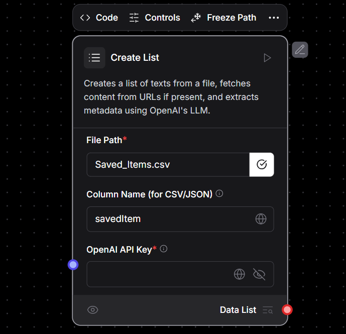

# Custom Component: Create List  

This folder contains a **LangFlow** workflow featuring a **custom-designed component** called **"Create List"**. This component processes input files (CSV, JSON, or TXT) to extract textual content, validate URLs, and retrieve metadata from web pages.  

---

## 📌 Overview  

The **"Create List"** component automates the extraction and structuring of web content by:  
1. **Processing input files** (CSV, JSON, TXT).  
2. **Extracting text and identifying URLs** within the files.  
3. **Validating URLs** to ensure accessibility.  
4. **Using WebBaseLoader** to fetch page content.  
5. **Extracting metadata** using an **OpenAI language model**.  
6. **Returning structured Data objects** containing both content and metadata.  

---

## 🏗️ Workflow Details  

### **1️⃣ Input Handling**
- Accepts **CSV, JSON, or TXT** files.  
- Extracts **textual content and URLs** from the provided input.  

### **2️⃣ URL Validation & Content Retrieval**
- Validates extracted URLs.  
- Uses **WebBaseLoader** to **fetch webpage content**.  
- Retrieves **page metadata** using an **OpenAI language model**.  

### **3️⃣ Metadata Extraction & Structuring**
- Extracted metadata includes:  
  - **Webpage Name**  
  - **Number of Likes**  
  - **Number of Comments**  
  - **Author Name**  
  - **Publication Date**  
- Metadata is formatted in a structured **JSON format**.  

### **4️⃣ Data Object Generation**
- The processed data is encapsulated as a list of **Data objects**, containing:  
  - **Original content**  
  - **Extracted metadata**  

---

## 📌 Workflow Diagram  

**🔹 Workflow Image:**  
  

---

## 🛠️ Implementation Features  

✔ **Comprehensive Logging** – Tracks processing steps.  
✔ **Error Handling** – Ensures robust functionality and prevents failures.  
✔ **Scalable Design** – Can be adapted for larger datasets.  

---

## 🚀 How to Use  

1. **Import** the JSON file into **LangFlow** ([Guide](https://github.com/langflow-ai/langflow)).  
2. Provide a **CSV, JSON, or TXT** file as input.  
3. The **"Create List"** component will process the file, extract URLs, validate them, and retrieve metadata.  
4. The system returns a structured JSON list containing **content and metadata**.  
5. Modify components as needed for custom use cases.  

---

## 📜 License  
This repository is open-source. Feel free to modify and use the workflows as needed.  

---

## 🔗 Resources  
- 📖 **LangFlow Docs:** [https://docs.langflow.org](https://docs.langflow.org)  
- 🏗️ **LangChain Docs:** [https://python.langchain.com](https://python.langchain.com)  
- 💬 **Join the Community:** [LangFlow Discord](https://discord.gg/langflow)  
