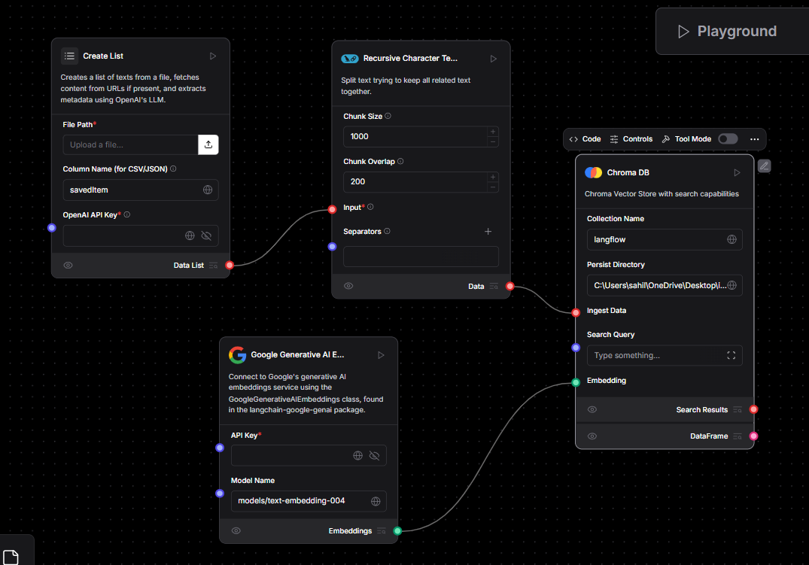
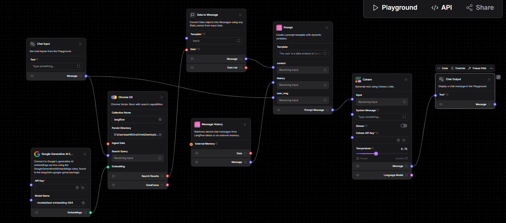

# RAG Flows for LinkedIn Data  

This folder contains two **RAG (Retrieval-Augmented Generation)** workflows built using **LangFlow**. These workflows process LinkedIn **SavedItems CSV files**, extract metadata, store data in vector stores, and perform **vector search-based Q&A**.  

## 📌 Overview of Flows  

### 1️⃣ **LinkedIn Vector Store RAG (Updated)**
This flow processes a **LinkedIn SavedItems CSV file**, extracts links, scrapes their metadata, and converts the data into vector embeddings. The vectors are stored in **ChromaDB** for later retrieval.  

**🔹 Components Used:**  
- 📂 **File Input** – Loads the LinkedIn **SavedItems CSV**.  
- 🌐 **Web Scraper** – Extracts metadata from the links.  
- 📄 **Recursive Text Splitter** – Splits extracted data into chunks.  
- 🧠 **OpenAI Embeddings** – Converts text into vectors.  
- 📦 **ChromaDB Vector Store** – Stores and retrieves vectorized data.  

**📌 Workflow Image:**  
  

---

### 2️⃣ **Vector Search RAG**
This flow allows users to perform **chat-based Q&A** on stored LinkedIn data using **retrieval-augmented generation (RAG)**. Users input queries, retrieve relevant vectors, and generate responses using **OpenAI's LLM**.  

**🔹 Components Used:**  
- 💬 **Chat Input** – Accepts user queries.  
- 🧠 **OpenAI LLM Model** – Generates responses.  
- 🔎 **Embedding Model** – Converts queries into vectors.  
- 📥 **Vector Search (ChromaDB)** – Retrieves the most relevant data.  
- 📝 **Prompt Template** – Formats query responses.  
- ⏳ **Chat History** – Maintains conversation history.  
- 📤 **Chat Output** – Displays generated answers.  

**📌 Workflow Image:**  
  

---

## 🚀 How to Use  

1. **Import** the JSON files into **LangFlow** following [these instructions](https://github.com/langflow-ai/langflow).  
2. For the first flow, upload your **LinkedIn SavedItems CSV**, and the flow will process and store the vectors.  
3. Use the second flow to perform **semantic search-based Q&A** on stored LinkedIn data.  
4. Modify components as needed for custom use cases.  

---

## 📜 License  
This repository is open-source. Feel free to modify and use the workflows as needed.  

---

## 🔗 Resources  
- 📖 **LangFlow Docs:** [https://docs.langflow.org](https://docs.langflow.org)  
- 🏗️ **LangChain Docs:** [https://python.langchain.com](https://python.langchain.com)  
- 💬 **Join the Community:** [LangFlow Discord](https://discord.gg/langflow)  
