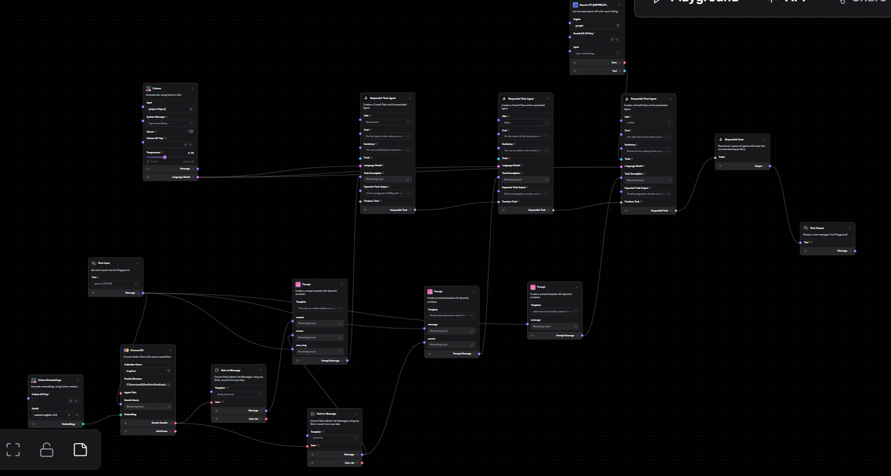

# Sequential Agent RAG Workflow  

This folder contains a **Sequential Task Agent** workflow, which automates task execution in a predefined order. This approach ensures that each step is completed before proceeding, making it ideal for workflows where dependencies exist between tasks.  

## 📌 Overview  

This workflow integrates **Retrieval-Augmented Generation (RAG)** with a **Sequential Task Agent**, enabling multi-agent collaboration for enhanced data retrieval, source verification, and response validation. It specifically processes **LinkedIn Saved Items** as a **vector store** and enhances retrieval capabilities through additional agents.  

---

## 🏗️ Workflow Structure  

### **1️⃣ Agent 1: Vector Store RAG (Retrieval)**
- Loads **LinkedIn Saved Items (CSV or JSON)**.  
- Converts text data into **vector embeddings**.  
- Stores vectors in a **ChromaDB vector store**.  
- Retrieves relevant data for queries.  

### **2️⃣ Agent 2: Source Retrieval**
- Extracts and returns the **source link** of retrieved content.  
- Helps users verify where the information comes from.  

### **3️⃣ Agent 3: Validation & Enhancement (Google Search API)**
- Uses the **Google Search API** to validate retrieved data.  
- Enhances responses by cross-referencing search results.  
- Improves the accuracy of generated outputs.  

---

## 🔗 General Context  

- The **LinkedIn saved items** act as the primary data source.  
- Data is embedded into a **vector store (ChromaDB)** for efficient retrieval.  
- **Multi-agent interaction** allows dynamic responses by collaborating on complex queries.  
- The system provides **accurate, source-backed answers** with **real-time validation**.  

---

## 📌 Workflow Diagram  

**🔹 Workflow Image:**  
  

---

## 🚀 How to Use  

1. **Import** the JSON file into **LangFlow** ([Guide](https://github.com/langflow-ai/langflow)).  
2. Upload your **LinkedIn Saved Items CSV/JSON**, and the first agent will process the data.  
3. Query the system, and the **Vector Store RAG** retrieves relevant content.  
4. The **Source Retrieval Agent** fetches the source links of retrieved data.  
5. The **Validation Agent** enhances and verifies responses using the **Google Search API**.  
6. Modify components as needed for your use case.  

---

## 📜 License  
This repository is open-source. Feel free to modify and use the workflows as needed.  

---

## 🔗 Resources  
- 📖 **LangFlow Docs:** [https://docs.langflow.org](https://docs.langflow.org)  
- 🏗️ **LangChain Docs:** [https://python.langchain.com](https://python.langchain.com)  
- 💬 **Join the Community:** [LangFlow Discord](https://discord.gg/langflow)  
